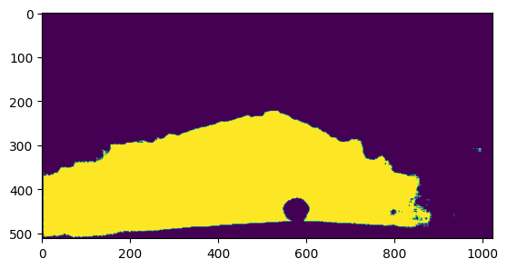
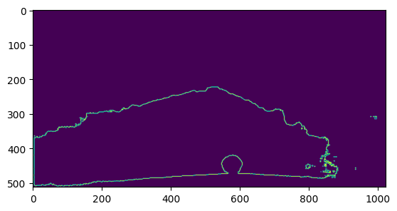
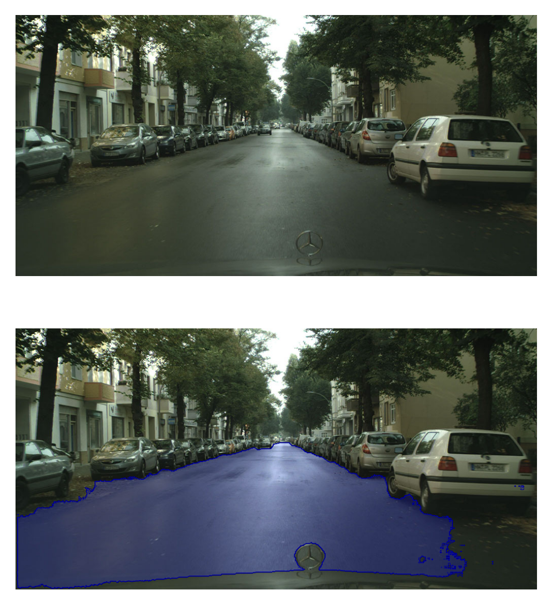

# Road-identification-via-Semantic-Segmentation
This repository presents an example of the use of the ENet model trained on the Cityscapes dataset. This example shows how to identify the region of pixels belonging to the road and its edge.

## Installation
Clone this repository:
```bash
git clone git@github.com:daniel-lima-lopez/Road-identification-via-Semantic-Segmentation.git
```

move to installation folder:
```bash
cd Road-identification-via-Semantic-Segmentation
```

## Example
This example is applied on the following test image:


The pixel region belonging to the road is characterized by the ENet model prediction, then its edge is identified by the gradient information of the image:





Finally, this information is highlighted in the original image:



This example can be run in the notebook [example.ipynb](example.ipynb)